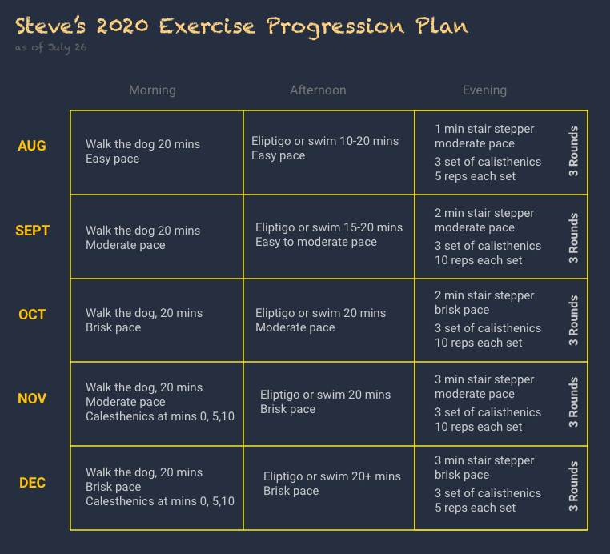

## The Crash

Last post I talked about becoming enamored with CrossFit, jumping into the deep end both feet, then
[sputtering and crashing](http://localhost:8000/blog/2020-07-19-push-too-hard-and-you-go-ever-the-edge/)
and just stopping all together.


**Be tough**, **work through the pain**, Those words can be attractive and inspiring, but will probably fail for for people starting at the
bottom rung of the fitness ladder. I don't care how tough you are mentally, if you push yourself beyond reasonable limits
your body and mind WILL MAKE YOU STOP.  No matter how much you have been attracted to vigorous activities in the past, I advise caution.
A crash will set you back.

## Lets Try This Again

I realize that two of the attractions of going all out are
```
  * The satisfaction and pride that comes with completing hard work
  * The positive physical after effects (endorphins, elevated mode, etc)
```

I have designed a program that is meant to be vigorous enough
**RELATIVE TO MY CURRENT FITNESS LEVEL** to tap into the benefits above, but not so vigorous
that I crash, based on the following principles
```
  * An evolving approach that incrementally adds intensity over the
    course of the remainder of the year
  * Everything should be planned relative to current fitness level,
    which will increase over time.
  * High enough impact to promote changes, and allow me to feel proud and
    to feel exhilarated
  * Not so intense that I bail/crash.  Going for exhilaration, not annihilation
```

  Also, it is very important that I treat this as a fluid endeavour.  If I need
  to change things in order to keep the enthusiasm high and the mental
  resistance under control, I WILL DO SO.

  OK, that all said, here it is

  


Stay tuned!
Steve

