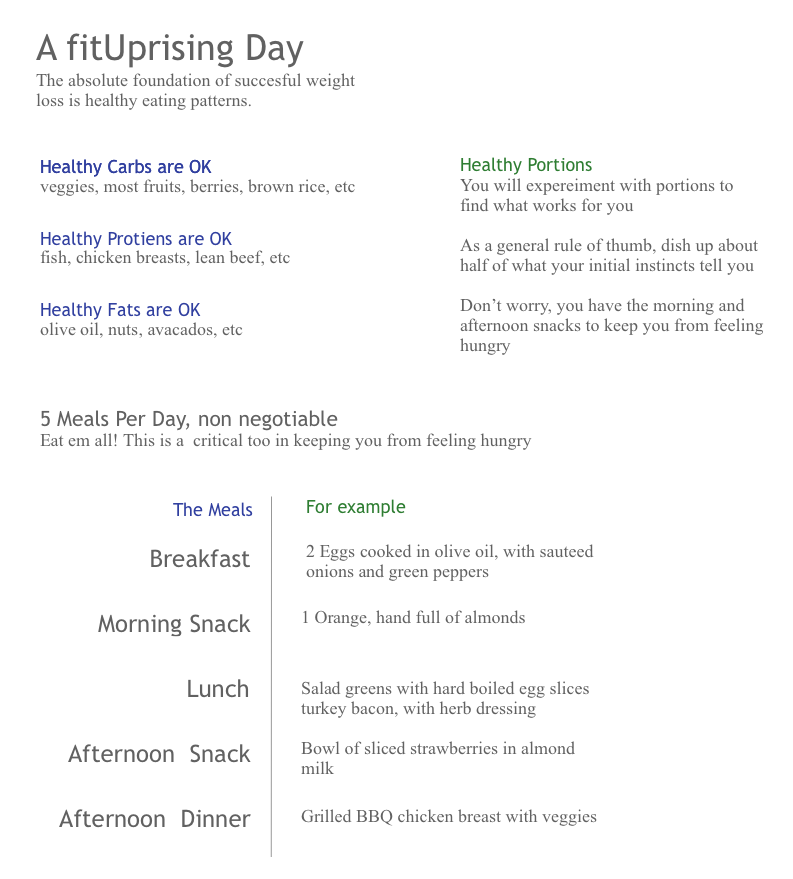

## Is Structure Needed for Weight Loss?

The short answer is an emphatic **YES**.  I have experimented with and experienced various approaches ranging from highly structured, to mostly unstructured.  In cases where I gave myself little to no structure I found it easy to make excuses.  Worse, I would tend to drift out of the mentality that "my health quest is on".  Your health quest should always be on.  It was also made it much easier to ignore preparation, and eat in ways that would lead to weight gain.

So, as part of fitUprising, we define a structure that is light weight and flexible, yet provides enough direction that your mental states and health habits are more likely to stay on track.

## Is Freedom Needed for Weight Loss?

Again the short answer is an emphatic **YES**.  If you don't allow your self variety and the freedom to eat some of the things that you want, over time your efforts will fail.  You will get tired of certain foods.  After too much rigour for too long you will snap, and just give up.

Freedom allows you to enjoy the process rather than hate it.  Freedom allows you to splurge every now and then, so that you can stay on track over the long run.  Freedom allows you to find the foods, portions, and movements that work for you.

## Freedom Within Structure

Structure can be liberating.  Structure can allow you to focus on creativity and self discovery without having to worry about all of the details.

A great example is music.  Over time composers have defined a core structure for music, defining specific notes for tones, duration of those notes, and effects of those notes.  However, this structure presents a canvas upon which an infinite variety of music can be created.  Music composed over the years is boundlessly rich, but is all based on a core structure.

Similarly, fitUprising defines a structure which give you a canvas upon which to find success and enjoyment in weight loss.  The structure points you in right direction, the freedom within the structure allows you to carry on a sustainable, enjoyable, successful weigh loss quest.

So, without further ado, here is what the fitUprising canvas looks like.  We will be writing much more about this in the future.

### Upcoming Articles

* Your Health Quest Should Always Be On
